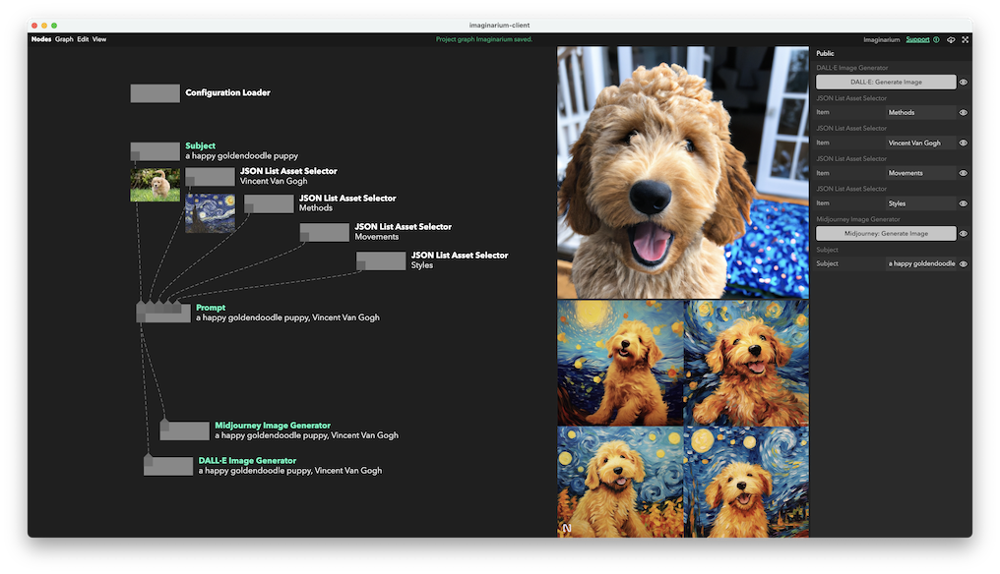

# Imaginarium

Imagine images with DALL·E and Midjourney with some helpful prompting.



## Getting Started

You'll need a Mac and [Nodes](https://nodes.io).

There's a `.env` file you will need to create under `packages/imaginarum-server` with your [Midjourney](https://github.com/erictik/midjourney-api), [DALL·E](https://openai.com/blog/dall-e-api-now-available-in-public-beta), and [Google Custom Search API](https://developers.google.com/custom-search/v1/overview) credentials. There's a template file in the same directory, so you can run the following command and fill in your details:

```
cp ./packages/imaginarium-server/.env.template ./packages/imaginarium-server/.env
```

Once you've got your credentials setup, from the project base directory, run:

```
npm start
```

Happy imagining!
